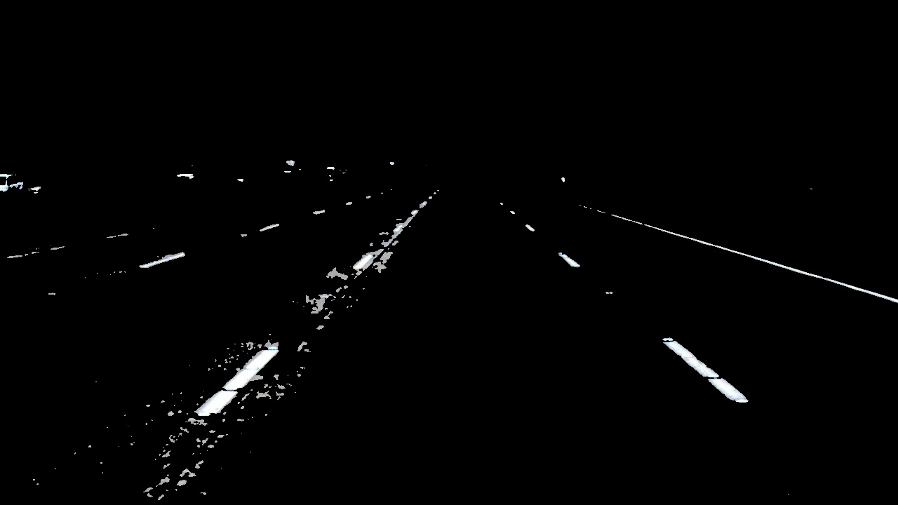
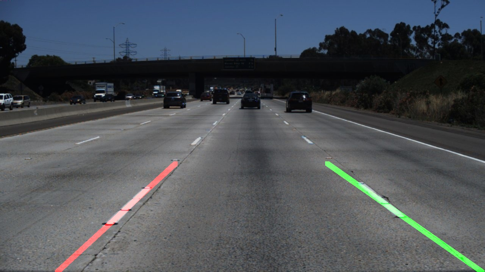

# Manual Lane Departure Detection System

This repository contains a complete pipeline for detecting road lanes from image sequences. The project focuses on manual algorithmic implementations, avoiding high-level library functions to demonstrate a fundamental understanding of spatial and frequency-domain image processing.

## The Detection Pipeline

The system processes raw frames through several distinct stages:

1. **Color Filtering:** Conversion to HSV space to isolate yellow and white lane markings while ignoring shadows.
2. **Gaussian Smoothing:** Manual 2D convolution with a Gaussian kernel to reduce high-frequency noise.
3. **Canny Edge Detection:** A custom-built detector for identifying sharp intensity transitions.
4. **Region of Interest (ROI):** Masking the image to a trapezoidal field of view relevant to the vehicle's path.
5. **Hough Transform:** Mapping edge pixels to $(\rho, \theta)$ space to identify structural lines.
6. **Linear Regression:** Fitting a best-fit line to filtered points to stabilize the lane boundaries.

## Mathematical Underpinnings

### 1. Gaussian Blur (Manual Convolution)
The smoothing is performed using a kernel derived from:  
$$\huge G(x, y) = \frac{1}{2\pi\sigma^2} e^{-\frac{x^2 + y^2}{2\sigma^2}}$$

### 2. Hough Transform Line Detection
Points in image space $(x, y)$ are transformed into the polar coordinate system:  
$$\huge \rho = x \cos(\theta) + y \sin(\theta)$$


## 📂 Project Structure

| File | Responsibility |
| :--- | :--- |
| `main.py` | Orchestrates the full pipeline from raw image to overlay. |
| `color_filter.py` | Manual Gaussian Blur and HSV thresholding. |
| `edge_detection.py` | Wrapper for custom-built Canny edge logic. |
| `hough_utils.py` | Implementation of the Hough Accumulator and line segments. |
| `line_detection.py` | Slope calculation, segment grouping, and Linear Regression. |
| `region_of_interest.py` | Trapezoidal mask generation for lane focusing. |

## Visualizing the Pipeline

<p align="center">
  <table>
    <tr>
      <td align="center"><b>1. Color Masking</b></td>
      <td align="center"><b>2. Hough Lines</b></td>
      <td align="center"><b>3. Final Overlay</b></td>
    </tr>
    <tr>
      <td></td>
      <td></td>
      <td></td>
    </tr>
  </table>
</p>


## Usage

### Installation
```bash
pip install numpy opencv-python

```

### Execution

```bash
python main.py --input_folder ./data/ --output_folder ./results

```

## Motive

This project was developed for educational purposes to understand the "math under the hood." While libraries like OpenCV offer optimized versions of these functions (using C++), the algorithms here are implemented in Python/NumPy to demonstrate a deep understanding of the underlying theory.
